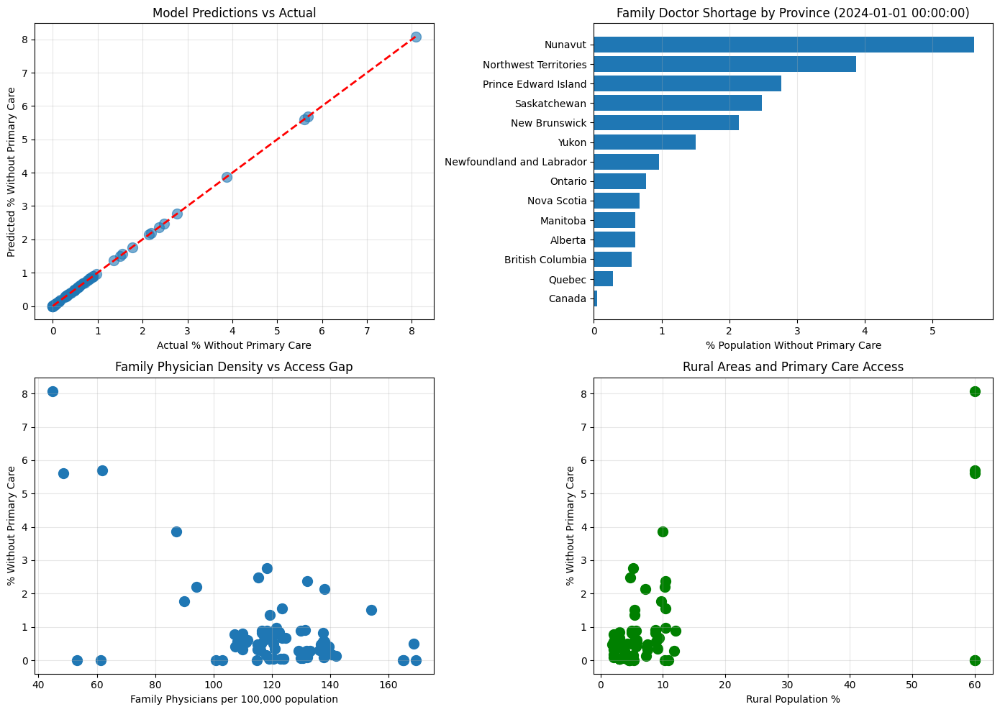

# Predicting-Primary-Care-Access-Canada

## Overview
Analyzes patient satisfaction with family doctor care in Canada using Statistics Canada Data to predict accessibility patterns and identify regional shortages.

---

## 🎯 Project Goals
- Measure actual patient experiences
- Reveal regional disparities in healthcare satisfaction
- Identify demographic groups with poorest access
- Provide quantitative foundatin for predicting family doctor shortage patterns

## 🗂 Datasets
**Dataset 1**: Patient satisfaction with family doctors"
- **Source**: [Statistics Canada CCHS (Canadian Community Health Survey)](https://open.canada.ca/data/en/dataset/95938131-77e3-4ae9-8fde-9bb024dad418)
- **Table**: 13-10-0495
- **Coverage**: All Canadian provinces and territories, 2000-present
- **Variables**: Patient satisfaction by age, sex, geographic region

**Dataset 2**: Physician supply, distribution and migration
- **Source**: [CIHI (Physician Supply Data), select "Supply, Distribution and Migratio" XLSX](https://www.cihi.ca/en/physicians )
- **Coverage**: All Canadian provinces and territories, 1968-2024
- **Variables**: Physicians by jurisdiction, specialty, demographic characteristics, geographic distribution, physician migration, practice patterns and employment, gender composition of workforce.

Why I chose these datasets:
- Open and reliable data source
- Comprehensive metrics and dimensions
- Directly addresses research problem
- ML ready format (available as CSV, XLXS)
- Practical advantages for analysis (large sample, multiple years of data)

## 🛠 Tech Stack

Languages & Libraries
- Python
- Pandas, NumPy
- Matplotlib, Seaborn
- Scikit-learn
- Statsmodels
- Jupyter Notebook

Tools
- Git & GitHub
- VS Code or JupyterLab

## Data Limitations

- Satisfaction is subjective
- Survey-based data subject to response bias
- Does not directly measure physician supply or shortage

### XGBoost Model Limitations

The XGBoost model accounts for **physician density and rurality** but **cannot capture systemic factors** that also drive shortages, including:

- Physician burnout and mental health
- Healthcare funding constraints
- Inadequate infrastructure and equipment
- Lack of specialist support in remote areas
- Educational opportunities for rural physicians
- Administrative burden on primary care providers

These factors represent important areas for future research and policy consideration.


## Results on the data: CIHI physician supply analysis



#### Critical Findings
- **Nunavut's 8% access gap exceeds the national average of 0.9% by nearly 9-fold**, indicating a public health crisis requiring urgent intervention.
- **Despite representing only 0.12% of Canada's population**, Nunavut faces the most severe primary care access deficit. The **2020-2024 decline suggests worsening conditions require immediate policy attention**.
### Geographic Disparities
- Provinces with **60% rural population experience 5-8% without primary care access**
- Provinces with **<10% rural population maintain <2% access gaps**
- This reveals that **geographic dispersion is a critical barrier** to healthcare access, independent of total physician supply

#### Physician Density Benchmarks
- **To achieve <1-2% access gaps:** Country should maintain **at least 110-140 family physicians per 100,000 population**
- **Current status:** Only urban centers and well-resourced provinces meet this standard
### Recommended Policy Interventions
To address these disparities, the following measures should be implemented:

- **Targeted recruitment programs** for rural and remote physicians
- **Retention incentives** (housing subsidies, education support, professional development)
- **Telemedicine expansion** to bridge geographic gaps
- **Infrastructure development** in underserved regions
- **Healthcare workforce planning** to prevent physician migration from remote areas

---

## 📁 Folder Structure

```
Predicting-Primary-Care-Access-Canada/
│
├── data/
│   ├── CIHI.ipynb
│   ├── output_ph.png
│   └── satisfactory_surveys.ipynb
│
├── notebooks/
│   ├── 01_data_exploration_physicians.ipynb
│   └── 02_data_exploration_satisfaction.ipynb
│
├── README.md
└── requirements.txt


```
---


## ▶️ How to Install and Run

1. Clone the repository
```
git clone https://github.com/....
cd Predicting-Primary-Care-Access-Canada
```

2. Create and activate a virtual environment
```
python3 -m venv venv
source venv/bin/activate  # macOS/Linux
venv\Scripts\activate     # Windows
```

3. Install dependencies
```
pip install -r requirements.txt
```

---